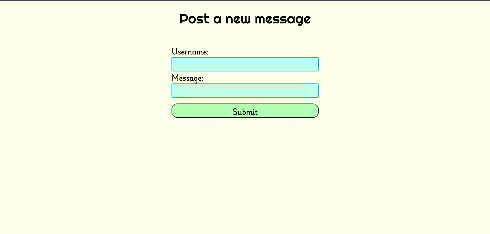

# Message Board

A small message board application created with ExpressJS and MongoDB

Live link: https://messageboard-cf85.onrender.com (As its hosted on free tier of Render, it may or may not work)

## To run:

- Clone the repository
- `cd` into the folder
- `npm install` to install the dependencies
- Create .env file with your mongodb url as shown in .env.example file
- `npm run serverstart` to start the server
- Go to http://localhost:3000 to access the website

## Screenshots

